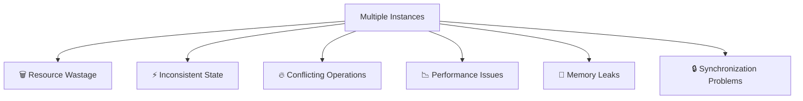
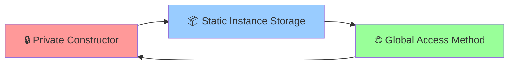
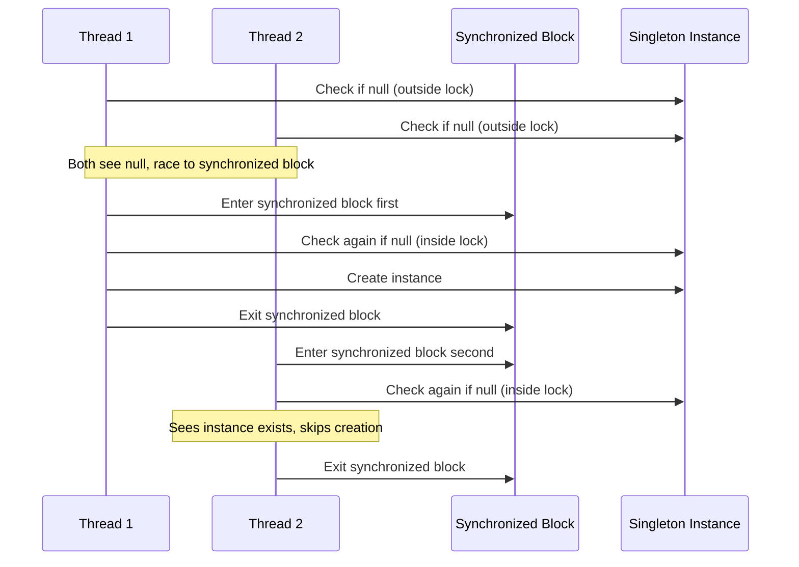
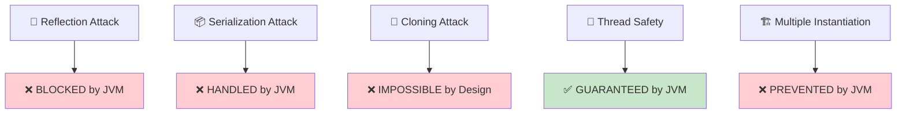
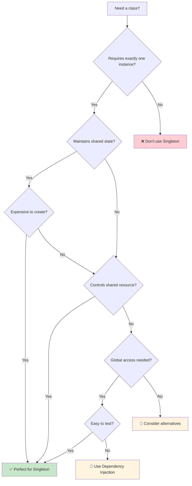
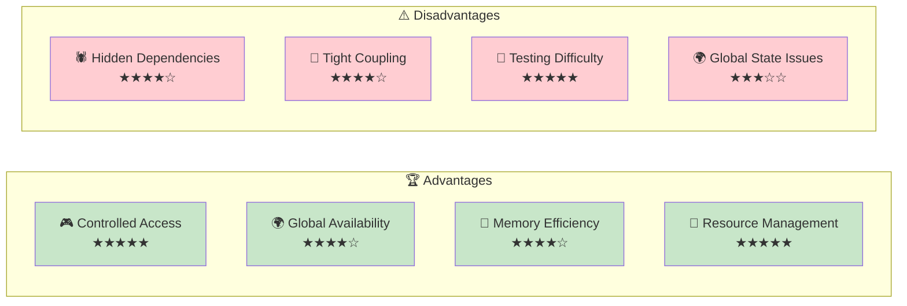
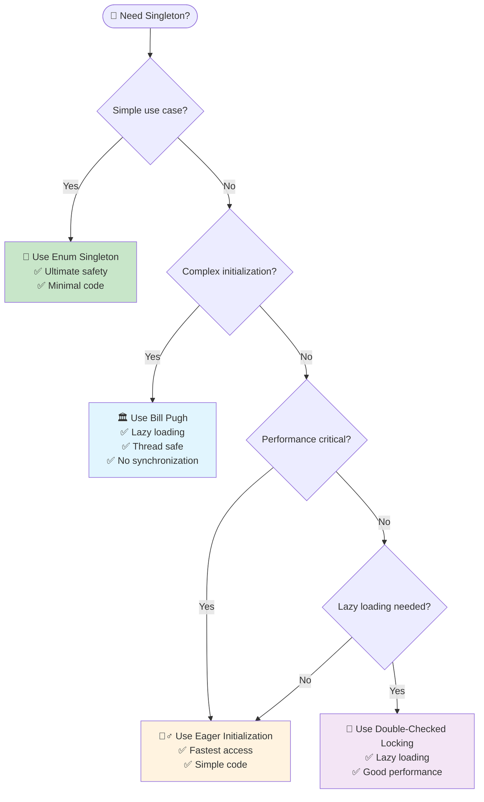
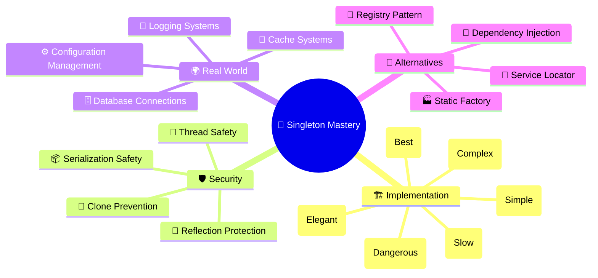
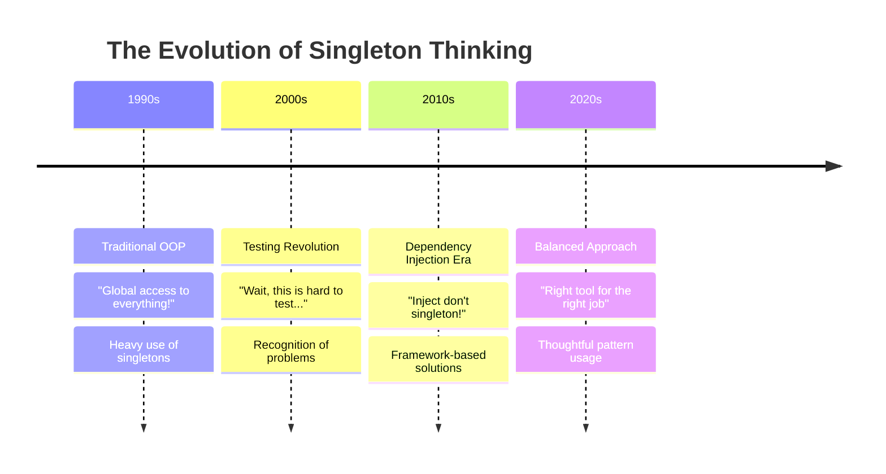

# 🎯 Singleton Design Pattern

<div align="center">


_"One instance to rule them all"_ 👑

</div>

---

## 📖 Overview

The **Singleton Design Pattern** is a fundamental **Creational Design Pattern**. It ensures that a class has only **one instance** throughout the entire application lifecycle while providing a **global access point** to that precious instance.

## 🎯 Intent & Core Principles

### 🎪 Primary Goals:

- 🏆 **Ensure Singleton Instance**: Guarantee that a class has only one instance
- 🌐 **Global Access Point**: Provide worldwide access to that instance
- 🎮 **Control Instantiation**: Take full control of the object creation process
- 💾 **Resource Management**: Efficiently manage shared resources

## 🚨 Problem Statement

Imagine you're building a complex application where certain resources are **precious** and **expensive** to create. You definitely don't want multiple instances floating around!

### 🏭 Common Scenarios Requiring Singleton:

| 🎯 Use Case                      | 📋 Description                      | ⚠️ Risk of Multiple Instances               |
| -------------------------------- | ----------------------------------- | ------------------------------------------- |
| 💾 **Database Connection Pools** | Manage expensive DB connections     | Connection leaks, resource exhaustion       |
| 📄 **Logger Services**           | Centralized logging mechanism       | Inconsistent log files, file conflicts      |
| ⚙️ **Configuration Managers**    | Application settings and properties | Conflicting configurations, memory waste    |
| 🧠 **Cache Systems**             | In-memory data storage              | Data inconsistency, cache fragmentation     |
| 🧵 **Thread Pool Managers**      | Control application threading       | Resource conflicts, performance degradation |
| 📂 **File System Handlers**      | Manage file operations              | File locking issues, I/O conflicts          |

### 💥 Consequences of Multiple Instances:



- **🗑️ Resource Wastage**: Unnecessary memory and CPU consumption
- **⚡ Inconsistent State**: Different instances holding different data
- **🔥 Conflicting Operations**: Race conditions and data corruption
- **📉 Performance Issues**: Overhead of managing multiple instances
- **💸 Memory Leaks**: Objects not properly garbage collected
- **🔒 Synchronization Problems**: Complex thread safety requirements

## 💡 The Elegant Solution

The Singleton pattern solves this elegantly through a **three-pronged approach**:

### 🛡️ The Singleton Trinity:



1. **🔒 Private Constructor** - Prevents external instantiation (No `new` keyword allowed!)
2. **📦 Static Instance Storage** - Holds the single instance in a static variable
3. **🌐 Global Access Method** - Provides controlled access via `getInstance()` method

### 🎭 The Magic Behind the Scenes:

```java
// 🚫 This is BLOCKED!
MyClass obj = new MyClass(); // Compilation Error!

// ✅ This is the ONLY way!
MyClass obj = MyClass.getInstance(); // Always returns the same instance
```

## 🏗️ UML Class Diagram

```
┌─────────────────────────────────────────┐
│               🎯 Singleton              │
├─────────────────────────────────────────┤
│ 🔒 - instance: Singleton (static)       │
│ 📊 - data: String                       │
├───────────────────────────────────────-─┤
│ 🚫 - Singleton()                        │ ← Private Constructor
│ 🌐 + getInstance(): Singleton (static)  │ ← Global Access Point
│ ⚙️ + doSomething(): void                │ ← Business Logic
│ 📝 + getData(): String                  │
│ 🔧 + setData(data: String): void        │
└─────────────────────────────────────────┘
```

### 🔍 Diagram Explanation:

- **🔒 Private Static Instance**: The single instance stored as a class variable
- **🚫 Private Constructor**: Blocked from external access (marked with -)
- **🌐 Public Static Method**: The only way to get the instance (marked with +)
- **⚙️ Business Methods**: Normal public methods for functionality

## 🛠️ Implementation Approaches

The beauty of Singleton lies in its variety! Here are **6 powerful approaches**, each with its own superpowers and kryptonite:

### 1. ⚡ Eager Initialization (Thread-Safe by Birth)

> **Philosophy**: _"Why wait? Create it now!"_

This approach creates the instance at **class loading time** - no questions asked, no delays, just pure eagerness!

```java
public class EagerSingleton {
    // 🚀 Instance created immediately when class loads
    private static final EagerSingleton instance = new EagerSingleton();

    // 🔒 Fort Knox-level security: Private constructor
    private EagerSingleton() {
        System.out.println("🎉 EagerSingleton born at class loading!");
    }

    // 🌐 Your gateway to the singleton universe
    public static EagerSingleton getInstance() {
        return instance;
    }

    public void doSomething() {
        System.out.println("🔥 Doing something with blazing speed!");
    }
}
```

#### ✅ **Pros of Eager Initialization**:

| 🏆 Advantage                   | 📋 Detailed Explanation                                                      | 💡 Why It Matters                                                |
| ------------------------------ | ---------------------------------------------------------------------------- | ---------------------------------------------------------------- |
| **🧵 Thread Safety by Design** | JVM class loading mechanism ensures thread safety automatically              | No need to worry about synchronization code or volatile keywords |
| **⚡ Lightning Fast Access**   | No conditional checks or synchronization overhead during getInstance() calls | Perfect for high-frequency access patterns                       |
| **🛡️ Bulletproof Reliability** | Instance creation happens during class loading - very predictable            | No race conditions, no partial construction issues               |

#### ❌ **Cons of Eager Initialization**:

| 🚫 Disadvantage                   | 📋 Detailed Explanation                                                 | 💥 Potential Impact                                          |
| --------------------------------- | ----------------------------------------------------------------------- | ------------------------------------------------------------ |
| **💸 Memory Waste**               | Instance created even if never used by the application                  | Unnecessary memory consumption, especially for heavy objects |
| **🚀 Slower Application Startup** | Heavy initialization happens at class loading time                      | Increased application startup time, poor user experience     |
| **🛠️ No Exception Handling**      | Constructor exceptions during class loading cause ClassInitializerError | Application may fail to start, difficult to recover          |
| **🔧 Inflexibility**              | Cannot pass parameters to constructor or conditionally create instance  | Limited configuration options, hard to adapt                 |
| **⚙️ No Lazy Loading Benefits**   | Misses opportunity to defer expensive operations until needed           | Poor resource utilization patterns                           |

**✅ Perfect For**:

- Simple lightweight singletons (loggers, counters)
- Always-needed services (application constants)
- High-frequency access scenarios
- Educational/demonstration purposes

**❌ Avoid When**:

- Heavy/expensive initialization (database connections, file I/O)
- Conditional instance creation needed
- Constructor might throw exceptions
- Memory optimization is critical

### 2. 😴 Lazy Initialization (The Procrastinator's Choice)

> **Philosophy**: _"I'll create it when I need it... maybe tomorrow!"_

This approach embodies the spirit of procrastination - creating the instance only when absolutely necessary!

```java
public class LazySingleton {
    // 💤 Sleeping beauty: Waiting to be awakened
    private static LazySingleton instance;

    // 🔒 Private constructor keeping the gates closed
    private LazySingleton() {
        System.out.println("😴 LazySingleton finally waking up!");
    }

    // 🎯 The awakening call - but beware of race conditions!
    public static LazySingleton getInstance() {
        if (instance == null) {
            instance = new LazySingleton(); // ⚠️ Danger zone in multi-threading!
        }
        return instance;
    }

    public void doSomething() {
        System.out.println("🐌 Doing something... eventually!");
    }
}
```

#### ✅ **Pros of Lazy Initialization**:

| 🏆 Advantage                       | 📋 Detailed Explanation                                            | 💡 Why It Matters                                                    |
| ---------------------------------- | ------------------------------------------------------------------ | -------------------------------------------------------------------- |
| **💾 Optimal Memory Usage**        | Instance created only when actually needed by the application      | Saves memory if singleton is never used, better resource utilization |
| **🚀 Faster Application Startup**  | No initialization cost during application startup                  | Improved user experience, faster boot times                          |
| **🛠️ Flexible Exception Handling** | Constructor exceptions can be handled when getInstance() is called | Better error recovery, graceful degradation possible                 |
| **⚙️ Conditional Creation**        | Can implement logic to conditionally create instance               | More intelligent resource management                                 |
| **🎯 True Lazy Loading**           | Embodies lazy loading principles perfectly                         | Optimal for optional or rarely used components                       |

#### ❌ **Cons of Lazy Initialization**:

| 🚫 Disadvantage                      | 📋 Detailed Explanation                                         | 💥 Potential Impact                                            |
| ------------------------------------ | --------------------------------------------------------------- | -------------------------------------------------------------- |
| **💥 Thread Safety Nightmare**       | Multiple threads can create multiple instances simultaneously   | Breaks singleton contract, data inconsistency, race conditions |
| **🐛 Hard to Debug Race Conditions** | Thread-related bugs are intermittent and difficult to reproduce | Production failures, unpredictable behavior                    |
| **❌ Broken Singleton Guarantee**    | No guarantee of single instance in multi-threaded environment   | Violates fundamental singleton principle                       |
| **📈 Unpredictable Performance**     | First access slower due to initialization                       | Inconsistent response times                                    |

#### ⚠️ **The Multi-Threading Nightmare Scenario**:

```java
// 😱 What could go wrong with two threads?
Thread 1: if (instance == null) { // ✓ TRUE
Thread 2: if (instance == null) { // ✓ TRUE (still!)
Thread 1:     instance = new LazySingleton(); // Creates Instance A
Thread 2:     instance = new LazySingleton(); // Creates Instance B (Oops!)
// Result: Two instances! Singleton broken! 💥
```

**✅ Perfect For**:

- Single-threaded applications only
- Educational purposes (learning concepts)
- Prototyping and quick demos
- Legacy systems without threading

**❌ Never Use When**:

- Multi-threaded environments (99% of modern apps)
- Production systems
- Web applications
- Any system with concurrent access
- When reliability is important

**🚨 Critical Warning**: This approach is fundamentally broken in multi-threaded environments and should never be used in production code!

### 3. 🔒 Synchronized Method (The Heavy Guardian)

> **Philosophy**: _"Safety first, speed... well, maybe later!"_

This approach puts a big, heavy lock on the entire method. It's like having a bouncer who checks IDs even for people already inside the club!

```java
public class SynchronizedSingleton {
    // 💤 Patiently waiting for the right moment
    private static SynchronizedSingleton instance;

    private SynchronizedSingleton() {
        System.out.println("🔒 SynchronizedSingleton created safely!");
    }

    // 🛡️ The fortress method: Safe but slow
    public static synchronized SynchronizedSingleton getInstance() {
        if (instance == null) {
            instance = new SynchronizedSingleton();
        }
        return instance; // 🐌 Every call goes through this bottleneck
    }

    public void doSomething() {
        System.out.println("🔐 Doing something very securely (but slowly)!");
    }
}
```

#### ✅ **Pros of Synchronized Method**:

| 🏆 Advantage                       | 📋 Detailed Explanation                                                             | 💡 Why It Matters                                 |
| ---------------------------------- | ----------------------------------------------------------------------------------- | ------------------------------------------------- |
| **🛡️ Bulletproof Thread Safety**   | Synchronized keyword guarantees only one thread can execute getInstance() at a time | Complete protection against race conditions       |
| **💾 True Lazy Loading**           | Instance created only when first requested                                          | Memory efficient, no unnecessary allocation       |
| **🛠️ Flexible Exception Handling** | Constructor exceptions can be properly handled and reported                         | Better error management than eager initialization |

#### ❌ **Cons of Synchronized Method**:

| 🚫 Disadvantage                      | 📋 Detailed Explanation                                             | 💥 Potential Impact                                     |
| ------------------------------------ | ------------------------------------------------------------------- | ------------------------------------------------------- |
| **🐌 Severe Performance Bottleneck** | Every single call to getInstance() must wait for lock acquisition   | Significantly slower than non-synchronized alternatives |
| **🚦 Thread Contention**             | Multiple threads queue up waiting for synchronized block            | Poor scalability, decreased throughput                  |
| **⏱️ Unnecessary Synchronization**   | Synchronization needed only during first creation, not every access | Wasted CPU cycles, inefficient resource usage           |
| **📈 Performance Degradation**       | Performance gets worse as thread count increases                    | Especially bad in high-concurrency applications         |

#### ⚡ **Performance Impact Visualization**:

```
Without Synchronization:  🚀🚀🚀🚀🚀 (5 threads accessing simultaneously)
With Synchronization:     🚀----🚀----🚀----🚀----🚀 (One at a time)

Throughput Comparison:
Non-synchronized: ~1,000,000 calls/second
Synchronized:     ~100,000 calls/second (10x slower!)
```

**✅ Perfect For**:

- Low-frequency access patterns (configuration loading)
- Small applications with few threads
- Learning thread safety concepts
- Quick prototypes where performance isn't critical
- Legacy systems being incrementally improved

**❌ Avoid When**:

- High-performance requirements
- Frequent singleton access (logging, caching)
- Web applications with many concurrent users
- Real-time systems
- Microservices with high throughput
- When better alternatives are available (Double-Checked Locking, Bill Pugh)

### 4. 🎯 Double-Checked Locking (The Recommended Champion)

> **Philosophy**: _"Check twice, lock once, perform like a champion!"_

This is the **Goldilocks solution** - not too eager, not too lazy, but just right! It combines the best of both worlds with some serious engineering wizardry.

```java
public class DoubleCheckedLockingSingleton {
    // 🌟 The magical volatile keyword - prevents memory reordering
    private static volatile DoubleCheckedLockingSingleton instance;

    private DoubleCheckedLockingSingleton() {
        System.out.println("🎯 Double-Checked Locking Singleton created!");

        // 🛡️ Anti-reflection shield activated!
        if (instance != null) {
            throw new IllegalStateException("🚨 Reflection attack detected and blocked!");
        }
    }

    public static DoubleCheckedLockingSingleton getInstance() {
        // 🔍 First check: Quick and dirty (no locking)
        if (instance == null) {
            synchronized (DoubleCheckedLockingSingleton.class) {
                // 🔍 Second check: Double verification under lock
                if (instance == null) {
                    instance = new DoubleCheckedLockingSingleton();
                }
            }
        }
        return instance; // 🚀 Subsequent calls are lightning fast!
    }

    public void doSomething() {
        System.out.println("⚡ Doing something with optimal performance!");
    }
}
```

#### ✅ **Pros of Double-Checked Locking**:

| 🏆 Advantage                            | 📋 Detailed Explanation                                                    | 💡 Why It Matters                                     |
| --------------------------------------- | -------------------------------------------------------------------------- | ----------------------------------------------------- |
| **⚡ Optimal Performance**              | Synchronization only during first creation, subsequent calls are lock-free | Best of both worlds: thread safety + high performance |
| **🧵 Perfect Thread Safety**            | Volatile keyword + double checking prevents all race conditions            | Bulletproof protection against multiple instantiation |
| **💾 True Lazy Loading**                | Instance created only when actually needed                                 | Memory efficient, no waste of resources               |
| **🎯 Minimal Synchronization Overhead** | Lock acquired only once during entire application lifecycle                | Near-zero synchronization cost after initialization   |

#### ❌ **Cons of Double-Checked Locking**:

| 🚫 Disadvantage                | 📋 Detailed Explanation                                            | 💥 Potential Impact                     |
| ------------------------------ | ------------------------------------------------------------------ | --------------------------------------- |
| **🧠 Complex Implementation**  | Requires deep understanding of memory models and volatile keyword  | Higher chance of implementation errors  |
| **📚 Steep Learning Curve**    | Developers need to understand memory reordering and happens-before | Knowledge barrier for junior developers |
| **🐛 Subtle Bug Potential**    | Forgetting volatile keyword leads to hard-to-detect bugs           | Dangerous failures in production        |
| **⚙️ JVM Version Sensitivity** | Behavior can vary across different JVM implementations             | Potential compatibility issues          |

#### 🧠 **The Genius Behind Double-Checking**:



#### 🎪 **Why `volatile` is Your Best Friend**:

The `volatile` keyword prevents the infamous **"partial construction"** problem:

| **Without volatile**                                      | **With volatile**                                                         |
| --------------------------------------------------------- | ------------------------------------------------------------------------- |
| 😰 Other threads might see a partially constructed object | 🛡️ Guarantees that the instance is fully constructed before being visible |
| 💥 Memory reordering can break the pattern                | ✅ Prevents memory reordering issues                                      |
| 🐛 Subtle bugs that are hard to reproduce                 | 🔒 Reliable behavior across all platforms                                 |

**✅ Perfect For**:

- High-performance applications requiring lazy loading
- Enterprise systems with heavy singleton initialization
- Web applications with frequent singleton access
- Systems where both thread safety and performance matter
- When you have experienced developers on the team

**❌ Consider Alternatives When**:

- Team lacks deep threading knowledge
- Simplicity is more important than optimal performance
- Code readability is prioritized over performance
- Working with junior developers primarily
- Bill Pugh solution would work equally well

### 5. 🏛️ Bill Pugh Solution (The Architectural Masterpiece)

> **Philosophy**: _"Why fight the system when you can make it work for you?"_

This approach is pure architectural genius! It leverages the **JVM's class loading mechanism** to achieve thread safety without any explicit synchronization.

```java
public class BillPughSingleton {

    private BillPughSingleton() {
        System.out.println("🏛️ Bill Pugh Singleton - Architectural excellence!");
    }

    // 🎭 The Inner Class Magic Show
    private static class SingletonHelper {
        // 🎪 The star of the show: Instance created when helper class loads
        private static final BillPughSingleton INSTANCE = new BillPughSingleton();
    }

    // 🎯 The elegant access point
    public static BillPughSingleton getInstance() {
        return SingletonHelper.INSTANCE; // 🚀 JVM guarantees thread safety!
    }

    public void doSomething() {
        System.out.println("🎨 Doing something with architectural elegance!");
    }
}
```

#### ✅ **Pros of Bill Pugh Solution**:

| 🏆 Advantage                         | 📋 Detailed Explanation                                                                     | 💡 Why It Matters                                          |
| ------------------------------------ | ------------------------------------------------------------------------------------------- | ---------------------------------------------------------- |
| **🎯 Perfect Lazy Loading**          | Inner class loaded only when getInstance() is called, guaranteeing true lazy initialization | Optimal memory usage, instance created exactly when needed |
| **🛡️ JVM-Guaranteed Thread Safety**  | Leverages JVM's class loading mechanism which is inherently thread-safe                     | No explicit synchronization needed, bulletproof safety     |
| **⚡ Zero Synchronization Overhead** | No locks, no volatile keywords, no performance penalties                                    | Maximum performance after class loading                    |
| **🔧 No Volatile Complexity**        | Avoids the complexity and potential pitfalls of volatile keyword                            | Simpler than Double-Checked Locking                        |
| **🛠️ Flexible Exception Handling**   | Constructor exceptions are properly handled during class loading                            | Better than eager initialization for error scenarios       |

#### ❌ **Cons of Bill Pugh Solution**:

| 🚫 Disadvantage              | 📋 Detailed Explanation                                        | 💥 Potential Impact                      |
| ---------------------------- | -------------------------------------------------------------- | ---------------------------------------- |
| **📚 Knowledge Barrier**     | Requires understanding of JVM class loading mechanics          | May be confusing for junior developers   |
| **🔍 Less Obvious Behavior** | The lazy loading mechanism isn't immediately apparent          | Debugging might be slightly more complex |
| **🎭 Inner Class Overhead**  | Slight overhead of additional class file generation            | Minimal but measurable metadata overhead |
| **🔧 Limited IDE Support**   | Some IDEs may not immediately show the dependency relationship | Minor development tool limitations       |

#### 🎪 **The JVM Class Loading Magic**:

```mermaid
graph TD
    A[Application Starts] --> B[BillPughSingleton.class Loaded]
    B --> C[SingletonHelper NOT Loaded Yet]
    C --> D[First Call to getInstance()]
    D --> E[JVM Loads SingletonHelper.class]
    E --> F[INSTANCE Created Atomically]
    F --> G[Thread-Safe by JVM Design]

    style A fill:#e1f5fe
    style E fill:#f3e5f5
    style F fill:#e8f5e8
    style G fill:#fff3e0
```

#### 🎩 **Why This is Pure Magic**:

1. **🏗️ Lazy Loading**: Inner class loaded only when `getInstance()` is called
2. **🛡️ Thread Safety**: JVM class loading is inherently thread-safe
3. **⚡ Performance**: No synchronization overhead after initialization
4. **🎯 Simplicity**: Clean and easy to understand

**✅ Perfect For**:

- Complex singletons requiring lazy initialization
- High-performance applications
- Production enterprise systems
- When you want thread safety without explicit synchronization
- Teams with solid Java knowledge
- Clean, maintainable codebases

**❌ Consider Alternatives When**:

- Working primarily with junior developers
- Extreme simplicity is required (use Enum instead)
- Reflection attacks are a major concern
- You need the absolute simplest solution
- Working in environments where JVM behavior might vary

### 6. 🌟 Enum Singleton (The Ultimate Boss)

> **Philosophy**: _"Why fight when you can be the system itself?"_

Meet the **Chuck Norris** of Singleton implementations! The Enum approach doesn't just implement Singleton - it **IS** the Singleton! This is the most powerful and secure implementation, blessed by **Joshua Bloch** himself in "Effective Java".

```java
public enum EnumSingleton {
    INSTANCE; // 👑 Behold, the singleton incarnate!

    // 🎬 Constructor called exactly once by JVM
    EnumSingleton() {
        System.out.println("👑 Enum Singleton - The Ultimate Power!");
    }

    public void doSomething() {
        System.out.println("💫 Doing something with ultimate singleton power!");
    }

    // 🎯 Additional methods showcase the flexibility
    public void performOperation() {
        System.out.println("⚡ Performing operations with enum superpowers!");
    }

    // 💾 Can maintain state like any other singleton
    private String data = "Singleton Data";

    public String getData() {
        return data;
    }

    public void setData(String data) {
        this.data = data;
    }
}
```

#### ✅ **Pros of Enum Singleton**:

| 🏆 Advantage                         | 📋 Detailed Explanation                                                   | 💡 Why It Matters                                  |
| ------------------------------------ | ------------------------------------------------------------------------- | -------------------------------------------------- |
| **🛡️ Unbreakable Security Fortress** | JVM prevents reflection, serialization, and cloning attacks automatically | Ultimate security without writing defensive code   |
| **👑 Simplest Implementation**       | Most concise singleton code possible - just one line!                     | Reduced complexity, fewer bugs, easier maintenance |
| **⚡ JVM-Optimized Performance**     | Highly optimized by JVM, often faster than other approaches               | Best possible runtime performance                  |
| **🧵 Perfect Thread Safety**         | Thread safety guaranteed by JVM enum implementation                       | No threading bugs possible                         |
| **📦 Built-in Serialization**        | Serialization works correctly without any additional code                 | No readResolve() method needed                     |
| **🔒 Reflection-Proof by Design**    | JVM actively prevents reflection attacks on enum constructors             | Security that can't be accidentally broken         |
| **💡 Industry Best Practice**        | Recommended by Joshua Bloch (author of Effective Java)                    | Follows expert recommendations                     |
| **🎯 Clear Intent**                  | Code clearly communicates singleton intent                                | Self-documenting, obvious purpose                  |

#### ❌ **Cons of Enum Singleton**:

| 🚫 Disadvantage                        | 📋 Detailed Explanation                               | 💥 Potential Impact                           |
| -------------------------------------- | ----------------------------------------------------- | --------------------------------------------- |
| **🔗 Inheritance Limitation**          | Cannot extend other classes (Java single inheritance) | Reduced flexibility for complex designs       |
| **🚀 Eager Initialization**            | Instance created at class loading time, not lazily    | Memory usage if singleton is never accessed   |
| **🎭 Interface-Only Implementation**   | Can only implement interfaces, not extend classes     | Design constraints for complex hierarchies    |
| **📚 Enum Learning Curve**             | Some developers unfamiliar with advanced enum usage   | Knowledge barrier for junior developers       |
| **🔧 Limited Constructor Flexibility** | Enum constructors have specific rules and limitations | Less flexible than regular class constructors |
| **⚙️ Debugging Differences**           | Debugger behavior slightly different for enums        | Minor debugging tool variations               |

#### 🛡️ **The Enum's Unbreakable Fortress**:



#### 🎯 **Why Enum is the Ultimate Choice**:

1. **🛡️ Reflection-Proof**: JVM prevents reflection attacks on enums
2. **📦 Serialization-Safe**: Built-in serialization support without extra code
3. **🔄 Clone-Impossible**: Enums cannot be cloned by design
4. **🧵 Thread-Safe**: JVM guarantees thread safety
5. **💡 Ultra-Simple**: Most concise implementation possible
6. **⚡ High Performance**: No synchronization overhead

#### 🎪 **Usage Examples**:

```java
// 🎯 Simple usage
EnumSingleton singleton = EnumSingleton.INSTANCE;
singleton.doSomething();

// 💾 State management
singleton.setData("New data");
System.out.println(singleton.getData());

// 🔍 Identity verification
EnumSingleton another = EnumSingleton.INSTANCE;
System.out.println(singleton == another); // Always true!
```

**✅ Perfect For**:

- Simple to medium complexity singletons
- When security is paramount (financial, healthcare systems)
- High-performance applications
- When you want the cleanest possible code
- Most production applications
- When team prefers simplicity over flexibility
- Educational examples and best practices

**❌ Consider Alternatives When**:

- Need to extend other classes (inheritance required)
- Lazy loading is absolutely critical
- Working with frameworks that expect regular classes
- Complex initialization requiring extensive constructor logic
- Team is unfamiliar with advanced enum patterns

**🏆 Recommendation**: This should be your **default choice** for most singleton implementations unless you have specific requirements that prevent its use!

## 🥷 Breaking Singleton Pattern - The Dark Arts

Even the mighty Singleton has its vulnerabilities! Let's explore the **dark arts** that can break our precious pattern and learn how to defend against them.

### 1. 🏹 Reflection Attack - The Backdoor Breach

> **The Threat**: _"What private constructor? I make my own rules!"_

Reflection is like having a master key that can open any lock. It can access private constructors and create multiple instances!

```java
// 😈 The Evil Reflection Attack
public class ReflectionAttacker {
    public static void hackSingleton() {
        try {
            // 🔓 Breaking into the private constructor
            Constructor<BillPughSingleton> constructor =
                BillPughSingleton.class.getDeclaredConstructor();
            constructor.setAccessible(true); // 🚪 Kicking down the door!

            // 💀 Creating multiple instances - Singleton broken!
            BillPughSingleton instance1 = constructor.newInstance();
            BillPughSingleton instance2 = BillPughSingleton.getInstance();

            System.out.println("Hack successful! Different instances: " +
                             (instance1 != instance2));
        } catch (Exception e) {
            System.out.println("🛡️ Hack prevented: " + e.getMessage());
        }
    }
}
```

#### 🛡️ Defense Strategy - The Counter-Attack:

```java
private BillPughSingleton() {
    // 🚨 Reflection detection and prevention
    if (SingletonHelper.INSTANCE != null) {
        throw new IllegalStateException(
            "🚨 Reflection attack detected! Singleton protection activated!");
    }
    System.out.println("🏛️ Singleton created legitimately");
}
```

### 2. 📦 Serialization Sneak Attack - The Identity Thief

> **The Threat**: _"I'll save you to disk and bring back a different you!"_

Serialization can create a **doppelganger** of your singleton when deserializing from disk!

```java
// 😈 The Serialization Attack Scenario
public class SerializationAttacker {
    public static void demonstrateAttack() {
        try {
            // 1. Get the original singleton
            SerializableSingleton original = SerializableSingleton.getInstance();
            original.setData("Original Data");

            // 2. 📦 Serialize to bytes
            ByteArrayOutputStream baos = new ByteArrayOutputStream();
            ObjectOutputStream oos = new ObjectOutputStream(baos);
            oos.writeObject(original);
            oos.close();

            // 3. 📤 Deserialize back to object
            ByteArrayInputStream bais = new ByteArrayInputStream(baos.toByteArray());
            ObjectInputStream ois = new ObjectInputStream(bais);
            SerializableSingleton deserialized = (SerializableSingleton) ois.readObject();
            ois.close();

            // 4. 😰 Check if singleton property is maintained
            System.out.println("Original: " + original.hashCode());
            System.out.println("Deserialized: " + deserialized.hashCode());
            System.out.println("Are they same? " + (original == deserialized));

        } catch (Exception e) {
            System.out.println("Error: " + e.getMessage());
        }
    }
}
```

#### 🛡️ Defense Strategy - The `readResolve()` Guardian:

```java
public class SerializableSingleton implements Serializable {
    private static final long serialVersionUID = 1L;
    private static volatile SerializableSingleton instance;
    private String data;

    private SerializableSingleton() {
        System.out.println("📦 SerializableSingleton created");
    }

    public static SerializableSingleton getInstance() {
        if (instance == null) {
            synchronized (SerializableSingleton.class) {
                if (instance == null) {
                    instance = new SerializableSingleton();
                }
            }
        }
        return instance;
    }

    // 🛡️ The magical method that saves the day!
    protected Object readResolve() {
        System.out.println("🛡️ readResolve() activated - returning original instance!");
        return getInstance(); // Returns the original singleton instance
    }

    // State management methods
    public void setData(String data) { this.data = data; }
    public String getData() { return data; }
}
```

### 3. 🔄 Cloning Catastrophe - The Evil Twin

> **The Threat**: _"Meet your evil twin brother!"_

If your singleton implements `Cloneable`, someone could create an evil twin!

```java
// 😈 The Cloning Attack
public class CloningAttacker {
    public static void attemptCloneAttack() {
        try {
            CloneSafeSingleton original = CloneSafeSingleton.getInstance();

            // 👯‍♂️ Attempt to create an evil twin
            CloneSafeSingleton clone = (CloneSafeSingleton) original.clone();

            System.out.println("😈 Clone attack successful!");
            System.out.println("Original: " + original.hashCode());
            System.out.println("Clone: " + clone.hashCode());

        } catch (CloneNotSupportedException e) {
            System.out.println("🛡️ Clone attack prevented: " + e.getMessage());
        }
    }
}
```

#### 🛡️ Defense Strategy - Override and Block:

```java
public class CloneSafeSingleton implements Cloneable {
    private static volatile CloneSafeSingleton instance;

    private CloneSafeSingleton() {
        System.out.println("🔄 CloneSafeSingleton created");
    }

    public static CloneSafeSingleton getInstance() {
        if (instance == null) {
            synchronized (CloneSafeSingleton.class) {
                if (instance == null) {
                    instance = new CloneSafeSingleton();
                }
            }
        }
        return instance;
    }

    // 🛡️ The ultimate clone blocker!
    @Override
    protected Object clone() throws CloneNotSupportedException {
        throw new CloneNotSupportedException(
            "🚫 Cloning not allowed for singleton! Nice try, evil twin!");
    }

    public void doSomething() {
        System.out.println("🔐 Doing something safely without clones");
    }
}
```

#### 🏆 The Ultimate Defense - Enum Singleton:

```java
// 👑 The unbreakable fortress - Enum Singleton
public enum UltimateSecureSingleton {
    INSTANCE;

    // 🛡️ Automatically protected against:
    // ✅ Reflection attacks
    // ✅ Serialization attacks
    // ✅ Cloning attacks
    // ✅ Thread safety issues

    public void doSomething() {
        System.out.println("👑 Operating with ultimate security!");
    }
}
```

## 🌟 Real-World Examples - Singleton in Action

Let's see how Singleton pattern powers real applications! These examples show practical implementations you might encounter in production systems.

### 1. 🗄️ Database Connection Manager - The Resource Guardian

> **Scenario**: Managing expensive database connections efficiently

In enterprise applications, database connections are **precious resources**. Creating too many can overwhelm the database, while creating too few can bottleneck your application.

```java
public class DatabaseConnectionManager {
    private static volatile DatabaseConnectionManager instance;
    private Connection connection;
    private final String url = "jdbc:mysql://localhost:3306/myapp";
    private final String username = "admin";
    private final String password = "secret123";

    // 🔒 Private constructor - no external creation allowed
    private DatabaseConnectionManager() {
        try {
            // 🚀 Initialize the precious database connection
            this.connection = DriverManager.getConnection(url, username, password);
            System.out.println("🗄️ Database connection established successfully!");
        } catch (SQLException e) {
            throw new RuntimeException("💥 Failed to create database connection", e);
        }
    }

    // 🌐 Global access point with thread safety
    public static DatabaseConnectionManager getInstance() {
        if (instance == null) {
            synchronized (DatabaseConnectionManager.class) {
                if (instance == null) {
                    instance = new DatabaseConnectionManager();
                }
            }
        }
        return instance;
    }

    // 🎯 Business methods
    public Connection getConnection() {
        return connection;
    }

    public void executeQuery(String sql) {
        try {
            Statement stmt = connection.createStatement();
            ResultSet rs = stmt.executeQuery(sql);

            System.out.println("📊 Query executed: " + sql);
            while (rs.next()) {
                // Process results
                System.out.println("📋 Result: " + rs.getString(1));
            }
            rs.close();
            stmt.close();
        } catch (SQLException e) {
            System.err.println("❌ SQL Error: " + e.getMessage());
        }
    }

    // 🧹 Cleanup method
    public void closeConnection() {
        try {
            if (connection != null && !connection.isClosed()) {
                connection.close();
                System.out.println("🔒 Database connection closed safely");
            }
        } catch (SQLException e) {
            System.err.println("⚠️ Error closing connection: " + e.getMessage());
        }
    }
}
```

**💡 Usage Example:**

```java
// ✅ Correct usage - always same connection
DatabaseConnectionManager dbManager = DatabaseConnectionManager.getInstance();
dbManager.executeQuery("SELECT * FROM users WHERE active = 1");

// 🎯 Another part of application - same instance
DatabaseConnectionManager sameManager = DatabaseConnectionManager.getInstance();
System.out.println("Same instance? " + (dbManager == sameManager)); // true
```

## 🎯 When to Use Singleton Pattern - The Decision Matrix

Choosing when to use Singleton is crucial! Here's a comprehensive guide to help you make the right decision.

### ✅ **Green Light Scenarios** - Use Singleton When:

| 🎯 Scenario                | 📋 Description                                                 | 🏆 Benefits                                           |
| -------------------------- | -------------------------------------------------------------- | ----------------------------------------------------- |
| **💾 Resource Management** | Managing expensive resources like DB connections, file handles | Prevents resource exhaustion, improves performance    |
| **📄 Centralized Logging** | Application-wide logging system                                | Consistent log format, no file conflicts              |
| **⚙️ Configuration Hub**   | Global application settings and properties                     | Single source of truth, easy configuration management |
| **🧠 Cache Systems**       | In-memory data caching                                         | Prevents cache fragmentation, consistent data         |
| **📊 Analytics Collector** | Gathering application metrics and events                       | Centralized data collection, batch processing         |
| **🔐 Security Manager**    | Authentication and authorization services                      | Centralized security policies                         |

### 🎪 **Real-World Success Stories**:

```java
// ✅ PERFECT use case: Database Connection Pool
public class ConnectionPoolManager {
    private static volatile ConnectionPoolManager instance;
    private final Queue<Connection> connectionPool;
    private final int MAX_CONNECTIONS = 10;

    private ConnectionPoolManager() {
        connectionPool = new ConcurrentLinkedQueue<>();
        initializePool();
    }

    public static ConnectionPoolManager getInstance() {
        if (instance == null) {
            synchronized (ConnectionPoolManager.class) {
                if (instance == null) {
                    instance = new ConnectionPoolManager();
                }
            }
        }
        return instance;
    }

    public Connection borrowConnection() {
        Connection conn = connectionPool.poll();
        if (conn == null) {
            // Create new connection if pool is empty
            conn = createNewConnection();
        }
        return conn;
    }

    public void returnConnection(Connection conn) {
        if (connectionPool.size() < MAX_CONNECTIONS) {
            connectionPool.offer(conn);
        } else {
            closeConnection(conn);
        }
    }
}
```

### ❌ **Red Light Scenarios** - Avoid Singleton When:

| 🚫 Scenario                        | 📋 Why to Avoid                               | 🔄 Better Alternative      |
| ---------------------------------- | --------------------------------------------- | -------------------------- |
| **🧮 Utility Functions**           | Just grouping static methods                  | Use static utility class   |
| **🧪 Testing Required**            | Need to mock or test with different instances | Use dependency injection   |
| **♻️ Multiple Instances Possible** | Might need different configurations later     | Use factory pattern        |
| **🏗️ Complex Dependencies**        | Requires multiple constructor parameters      | Use builder pattern        |
| **⚡ High-Frequency Access**       | Called millions of times per second           | Consider flyweight pattern |

### 🎨 **Anti-Pattern Examples**:

```java
// ❌ BAD: Using singleton for utility functions
public class MathUtilsSingleton {
    private static MathUtilsSingleton instance;

    public static MathUtilsSingleton getInstance() {
        // Unnecessary complexity for stateless operations
        return instance;
    }

    public int add(int a, int b) {
        return a + b; // This doesn't need singleton!
    }
}

// ✅ BETTER: Simple utility class
public class MathUtils {
    private MathUtils() {} // Prevent instantiation

    public static int add(int a, int b) {
        return a + b;
    }
}
```

### 🎯 **The Decision Flowchart**:



### 📊 **The Scorecard Comparison**:



## 🔄 Alternatives to Singleton - Modern Solutions

The software world has evolved! Here are modern alternatives that often work better than traditional Singleton:

### 1. 💉 Dependency Injection - The Modern Approach

> **Philosophy**: _"Don't call us, we'll call you!"_

Instead of classes finding their dependencies, we inject them! This makes testing easier and reduces coupling.

```java
// ❌ Traditional Singleton approach
public class OrderService {
    public void processOrder(Order order) {
        Logger logger = Logger.getInstance(); // Hidden dependency!
        ConfigManager config = ConfigManager.getInstance(); // More hidden deps!

        logger.info("Processing order: " + order.getId());
        // Business logic...
    }
}

// ✅ Dependency Injection approach
public class OrderService {
    private final Logger logger;
    private final ConfigManager configManager;

    // 💉 Dependencies injected via constructor
    public OrderService(Logger logger, ConfigManager configManager) {
        this.logger = logger;
        this.configManager = configManager;
    }

    public void processOrder(Order order) {
        logger.info("Processing order: " + order.getId()); // Clear dependency!
        // Business logic...
    }
}

// 🏭 Application setup with DI container
public class ApplicationContext {
    public static void main(String[] args) {
        // Create shared instances
        Logger logger = new ConsoleLogger();
        ConfigManager config = new FileConfigManager("app.properties");

        // Inject dependencies
        OrderService orderService = new OrderService(logger, config);
        PaymentService paymentService = new PaymentService(logger, config);

        // Use services
        orderService.processOrder(new Order("12345"));
    }
}
```

**🎯 Benefits of Dependency Injection:**

- ✅ **Testability**: Easy to mock dependencies
- ✅ **Flexibility**: Can swap implementations easily
- ✅ **Clear Dependencies**: No hidden coupling
- ✅ **Lifecycle Control**: Framework manages object lifecycle

### 2. 🏭 Static Factory Methods - Simple and Clean

> **Philosophy**: _"Let me create what you need!"_

Sometimes you don't need a singleton - just a convenient way to create objects!

```java
// ✅ Static Factory approach
public class ConnectionFactory {
    private static final String DEFAULT_URL = "jdbc:mysql://localhost:3306/myapp";
    private static final Properties connectionProps = loadProperties();

    // 🚫 Private constructor prevents instantiation
    private ConnectionFactory() {}

    // 🏭 Factory methods for different connection types
    public static Connection createConnection() {
        return createConnection(DEFAULT_URL);
    }

    public static Connection createConnection(String url) {
        return createConnection(url, connectionProps);
    }

    public static Connection createConnection(String url, Properties props) {
        try {
            return DriverManager.getConnection(url, props);
        } catch (SQLException e) {
            throw new RuntimeException("Failed to create connection", e);
        }
    }

    // 🔧 Specialized factory methods
    public static Connection createReadOnlyConnection() {
        Connection conn = createConnection();
        try {
            conn.setReadOnly(true);
            return conn;
        } catch (SQLException e) {
            throw new RuntimeException("Failed to set read-only", e);
        }
    }

    public static Connection createTransactionalConnection() {
        Connection conn = createConnection();
        try {
            conn.setAutoCommit(false);
            return conn;
        } catch (SQLException e) {
            throw new RuntimeException("Failed to set transactional", e);
        }
    }

    private static Properties loadProperties() {
        Properties props = new Properties();
        props.setProperty("user", "admin");
        props.setProperty("password", "secret");
        props.setProperty("useSSL", "true");
        return props;
    }
}
```

### 3. 📝 Registry Pattern - The Service Locator

> **Philosophy**: _"I know where everything is!"_

A registry maintains a collection of services and provides them on demand.

```java
// 🗂️ Service Registry implementation
public class ServiceRegistry {
    private static final Map<Class<?>, Object> services = new ConcurrentHashMap<>();
    private static final Map<String, Object> namedServices = new ConcurrentHashMap<>();

    // 🚫 Prevent instantiation
    private ServiceRegistry() {}

    // 📝 Register service by type
    public static <T> void register(Class<T> serviceClass, T instance) {
        services.put(serviceClass, instance);
        System.out.println("📝 Service registered: " + serviceClass.getSimpleName());
    }

    // 📝 Register service by name
    public static void register(String name, Object instance) {
        namedServices.put(name, instance);
        System.out.println("📝 Named service registered: " + name);
    }

    // 🔍 Get service by type
    @SuppressWarnings("unchecked")
    public static <T> T get(Class<T> serviceClass) {
        T service = (T) services.get(serviceClass);
        if (service == null) {
            throw new IllegalArgumentException("Service not found: " + serviceClass.getSimpleName());
        }
        return service;
    }

    // 🔍 Get service by name
    @SuppressWarnings("unchecked")
    public static <T> T get(String name, Class<T> expectedType) {
        Object service = namedServices.get(name);
        if (service == null) {
            throw new IllegalArgumentException("Named service not found: " + name);
        }
        if (!expectedType.isInstance(service)) {
            throw new ClassCastException("Service " + name + " is not of type " + expectedType.getSimpleName());
        }
        return (T) service;
    }

    // 🧹 Cleanup methods
    public static void unregister(Class<?> serviceClass) {
        services.remove(serviceClass);
        System.out.println("🗑️ Service unregistered: " + serviceClass.getSimpleName());
    }

    public static void unregister(String name) {
        namedServices.remove(name);
        System.out.println("🗑️ Named service unregistered: " + name);
    }

    public static void clear() {
        services.clear();
        namedServices.clear();
        System.out.println("🧹 All services cleared");
    }

    // 📊 Introspection methods
    public static void printRegisteredServices() {
        System.out.println("📊 Registered Services:");
        services.forEach((key, value) ->
            System.out.println("  🔧 " + key.getSimpleName() + " -> " + value.getClass().getSimpleName()));
        namedServices.forEach((key, value) ->
            System.out.println("  📛 " + key + " -> " + value.getClass().getSimpleName()));
    }

    public static boolean isRegistered(Class<?> serviceClass) {
        return services.containsKey(serviceClass);
    }

    public static boolean isRegistered(String name) {
        return namedServices.containsKey(name);
    }
}

// 💡 Usage example
public class RegistryExample {
    public static void main(String[] args) {
        // 📝 Register services
        ServiceRegistry.register(Logger.class, new ConsoleLogger());
        ServiceRegistry.register(ConfigManager.class, new FileConfigManager());
        ServiceRegistry.register("primaryDB", new MySQLConnection());
        ServiceRegistry.register("cacheDB", new RedisConnection());

        // 🔍 Use services
        Logger logger = ServiceRegistry.get(Logger.class);
        logger.info("Using registry pattern!");

        ConfigManager config = ServiceRegistry.get(ConfigManager.class);
        String appName = config.getProperty("app.name", "Default App");

        Connection primaryDB = ServiceRegistry.get("primaryDB", Connection.class);
        Connection cacheDB = ServiceRegistry.get("cacheDB", Connection.class);

        // 📊 Show registered services
        ServiceRegistry.printRegisteredServices();
    }
}
```

### 🎯 **Comparison Matrix**: Singleton vs Alternatives

| Aspect                | 👑 Singleton | 💉 Dependency Injection | 🏭 Static Factory | 📝 Registry Pattern |
| --------------------- | ------------ | ----------------------- | ----------------- | ------------------- |
| **🧪 Testability**    | ⭐⭐         | ⭐⭐⭐⭐⭐              | ⭐⭐⭐⭐          | ⭐⭐⭐              |
| **🔗 Coupling**       | ⭐⭐         | ⭐⭐⭐⭐⭐              | ⭐⭐⭐⭐          | ⭐⭐⭐              |
| **♻️ Flexibility**    | ⭐⭐         | ⭐⭐⭐⭐⭐              | ⭐⭐⭐            | ⭐⭐⭐⭐            |
| **💡 Simplicity**     | ⭐⭐⭐⭐     | ⭐⭐⭐                  | ⭐⭐⭐⭐⭐        | ⭐⭐⭐              |
| **🚀 Performance**    | ⭐⭐⭐⭐⭐   | ⭐⭐⭐⭐                | ⭐⭐⭐⭐⭐        | ⭐⭐⭐⭐            |
| **📚 Learning Curve** | ⭐⭐⭐⭐     | ⭐⭐⭐                  | ⭐⭐⭐⭐⭐        | ⭐⭐⭐⭐            |

### 🎭 **When to Choose Each Alternative**:

- **💉 Choose Dependency Injection** when you need maximum testability and flexibility
- **🏭 Choose Static Factory** when you need simple object creation without state
- **📝 Choose Registry Pattern** when you need runtime service discovery and registration
- **👑 Stick with Singleton** when you truly need exactly one instance with shared state

### 🎯 **The Ultimate Singleton Template**

Here's the perfect singleton template that follows all best practices:

```java
/**
 * 🏆 The Ultimate Singleton Implementation
 *
 * Features:
 * ✅ Thread-safe lazy initialization
 * ✅ Reflection attack protection
 * ✅ Serialization safety
 * ✅ Clone protection
 * ✅ Memory efficient
 * ✅ High performance
 *
 * @author The Singleton Master
 * @version 2.0.0
 */
public class UltimateSingleton implements Serializable {
    private static final long serialVersionUID = 1L;

    // 💾 Instance data
    private String data;
    private volatile boolean initialized = false;

    // 🔒 Private constructor with reflection protection
    private UltimateSingleton() {
        // 🛡️ Reflection attack prevention
        if (SingletonHolder.INSTANCE != null) {
            throw new IllegalStateException(
                "🚨 Reflection attack detected! Singleton already exists.");
        }

        // 💤 Simulate expensive initialization
        System.out.println("🏗️ Initializing Ultimate Singleton...");
        initializeExpensiveResources();
        initialized = true;
        System.out.println("✅ Ultimate Singleton ready!");
    }

    // 🏛️ Bill Pugh solution: Inner static helper class
    private static class SingletonHolder {
        // 🎯 Instance created only when accessed
        private static final UltimateSingleton INSTANCE = new UltimateSingleton();
    }

    // 🌐 Global access point
    public static UltimateSingleton getInstance() {
        return SingletonHolder.INSTANCE;
    }

    // 🛡️ Serialization safety: Return existing instance
    protected Object readResolve() {
        System.out.println("🔄 Deserialization detected - returning singleton instance");
        return getInstance();
    }

    // 🚫 Clone protection: Prevent evil twins
    @Override
    protected Object clone() throws CloneNotSupportedException {
        throw new CloneNotSupportedException(
            "🚫 Cloning not allowed! Singleton must remain unique.");
    }

    // 💼 Business methods
    public void performOperation(String operation) {
        if (!initialized) {
            throw new IllegalStateException("Singleton not properly initialized");
        }
        System.out.println("🎯 Performing operation: " + operation);
    }

    public String getData() {
        return data;
    }

    public void setData(String data) {
        this.data = data;
        System.out.println("📝 Data updated: " + data);
    }

    // 🔧 Expensive initialization simulation
    private void initializeExpensiveResources() {
        try {
            // Simulate database connection, file loading, etc.
            Thread.sleep(100);
            this.data = "Default singleton data - " + new Date();
        } catch (InterruptedException e) {
            Thread.currentThread().interrupt();
            throw new RuntimeException("Initialization interrupted", e);
        }
    }

    // 🧹 Cleanup method (if needed)
    public void shutdown() {
        System.out.println("🧹 Singleton shutting down...");
        // Cleanup resources
        initialized = false;
    }

    // 📊 Introspection methods
    public boolean isInitialized() {
        return initialized;
    }

    @Override
    public String toString() {
        return String.format("UltimateSingleton{data='%s', initialized=%s, hash=%d}",
                           data, initialized, hashCode());
    }
}
```

### 🎭 **Implementation Strategy Guide**

Choose your implementation based on your specific needs:



### 📋 **Singleton Code Review Checklist**

Before you ship your singleton, check these boxes:

- [ ] **🔒 Constructor is private**
- [ ] **🌐 getInstance() method is public and static**
- [ ] **🧵 Thread safety is properly handled**
- [ ] **💾 Serialization safety is implemented**
- [ ] **🛡️ Reflection attacks are prevented**
- [ ] **🚫 Cloning is blocked (if applicable)**
- [ ] **📝 Code is well-documented**
- [ ] **🧪 Unit tests are comprehensive**
- [ ] **⚡ Performance impact is acceptable**
- [ ] **🔄 Alternative patterns were considered**

### 🏆 **What We've Mastered**



### 🎯 **The Singleton Wisdom Hierarchy**

| 🏅 Level        | 🎓 Knowledge             | 🔧 Implementation      | 💡 Recommendation      |
| --------------- | ------------------------ | ---------------------- | ---------------------- |
| **🥉 Bronze**   | Basic understanding      | Eager/Lazy singleton   | Use for learning only  |
| **🥈 Silver**   | Thread safety awareness  | Synchronized methods   | Avoid in production    |
| **🥇 Gold**     | Performance optimization | Double-checked locking | Good for complex cases |
| **💎 Diamond**  | JVM mechanics mastery    | Bill Pugh solution     | Excellent choice       |
| **👑 Platinum** | Design pattern mastery   | Enum singleton         | Perfect for most cases |

### 🎪 **The Final Verdict**

The Singleton pattern is **controversial** but **essential** knowledge for every developer. Here's when to embrace it and when to avoid it:

### 🎭 **The Modern Approach**

In today's software development landscape:

1. **🥇 First Choice**: Consider **Dependency Injection** frameworks (Spring, Guice, etc.)
2. **🥈 Second Choice**: Use **Enum Singleton** for simple cases
3. **🥉 Third Choice**: Use **Bill Pugh Solution** for complex scenarios
4. **🚫 Last Resort**: Traditional synchronized approaches

### 🚀 **Evolution of Singleton Thinking**



### 📚 **Recommended Reading**

- 📖 **"Effective Java" by Joshua Bloch** - The enum singleton approach
- 📖 **"Design Patterns" by Gang of Four** - The original singleton documentation
- 📖 **"Clean Code" by Robert Martin** - When to avoid singletons
- 📖 **"Dependency Injection" by Dhanji Prasanna** - Modern alternatives

### 🔗 **Further Learning**

- 🎯 Practice with **LeetCode** singleton implementation problems
- 🏗️ Explore **Spring Framework** dependency injection
- 🧪 Study **JUnit** testing strategies for singletons
- 📚 Research **Microservices** patterns and singleton usage
